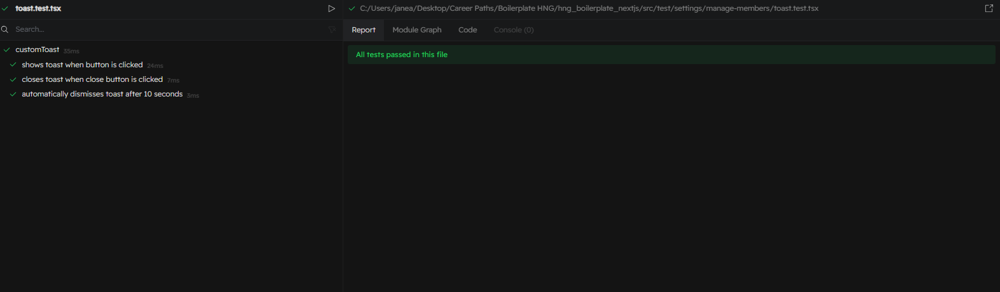
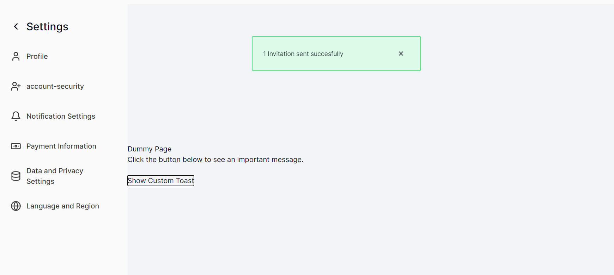

<!-- Do not delete this PR template. Just edit it to include the required information -->

# Description

<!-- If your PR fixes an open issue, use `Closes #999` to link your PR with the issue. #999 stands for the issue number you are fixing -->

<!-- Github Issue Example: Closes #31 -->

Closes #182

# Changes proposed

Implement a "1 Invite sent successfully" pop alert when an invitation is sent to an intending member.

## What were you told to do?

[FEAT] Organization settings > Manage Members page > Implement successfully sent invite pop / alert #182

## What did you do?

- Created a CustomToast component to display toast notifications with a custom message and description.
- Included a button on a dummy page to trigger the toast display with an optional close button to dismiss the toast.

- Added comprehensive tests for showing and dismissing the toast using @testing-library/react and vitest.
- Mocked the useToast module to ensure proper testing of the toast and dismiss functions.

# Check List (Check all the applicable boxes)

🚨Please review the [contribution guideline](CONTRIBUTING.md) for this repository.

- [x] My code follows the code style of this project.
- [x] This PR does not contain plagiarized content.
- [x] The title and description of the PR is clear and explains the approach.
- [x] I am making a pull request against the **dev branch** (left side).
- [x] My commit messages styles matches our requested structure.
- [x] My code additions will fail neither code linting checks nor unit test.
- [x] I am only making changes to files I was requested to.

# Screenshots/Videos

Tests

Implementation

